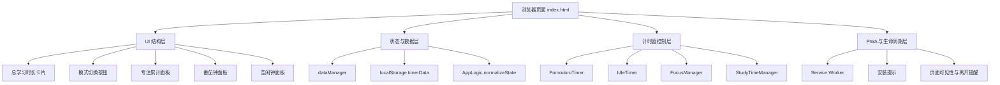

# 单 HTML 番茄钟与专注累计应用设计文档

## 1. 概述

当前版本是一个轻量级的单页面 Web 应用，集成了“番茄钟 / 空闲钟”与“专注累计”两套模式，目标是在一个界面中同时支持：

- 记录累计学习时长
- 进行番茄计时提醒
- 管理专注任务并累计专注时长
- 通过浏览器本地存储长期保存用户数据

应用由原生 HTML、CSS 和 JavaScript 搭建，核心逻辑分散在 [index.html](../index.html) 与 [app-logic.js](../app-logic.js) 中，并通过 [sw.js](../sw.js) 提供 PWA / 离线缓存能力。

## 2. 当前功能范围

### 2.1 总学习时长

- 在页面顶部展示累计学习时长。
- 以秒为单位存储，并在界面中以分钟/小时格式展示。
- 提供清空确认流程，避免误操作。
- 数据通过浏览器 localStorage 持久化。

### 2.2 番茄钟模式

- 默认时长为 25 分钟，可手动编辑。
- 提供开始、暂停、停止控制。
- 倒计时结束后会触发通知和声音提醒。
- 运行中时，界面会显示圆形进度反馈。

### 2.3 空闲钟模式

- 默认时长为 5 分钟，可手动编辑。
- 提供开始、暂停、停止控制。
- 使用条形进度条进行视觉反馈。
- 计时结束后会提醒用户。

### 2.4 专注累计模式

- 支持创建、重命名、删除专注任务。
- 可选择当前任务作为激活任务。
- 支持开始 / 暂停 / 结束一段专注累计。
- 每个任务会记录累计时长、今日时长、最近历史记录。
- 支持日 / 周 / 月统计切换。
- 当前任务会显示进行中状态、状态灯、呼吸动画和详情卡片。

## 3. 当前架构

### 3.1 页面结构

主界面由以下几个区域组成：

- 总学习时长区域
- 模式切换按钮：定时提醒 / 专注累计
- 专注面板：任务列表、状态、统计切换、最近记录
- 番茄钟区域
- 空闲钟区域

### 3.2 逻辑分层

- [index.html](../index.html)
  - 负责页面结构、样式、事件绑定和 DOM 渲染。
  - 包含番茄钟 / 空闲钟控制器、专注面板控制器、模态提示框和主题样式。

- [app-logic.js](../app-logic.js)
  - 负责状态规范化、默认值初始化、任务创建/重命名/删除、累计时长更新、专注历史记录和统计汇总。
  - 所有数据操作尽量集中在这一层，确保 UI 层更轻。

- [sw.js](../sw.js)
  - 负责缓存静态资源，支持 PWA 的离线访问与版本更新。

## 4. 状态模型

应用当前使用一个统一的状态对象，保存在浏览器 localStorage 中，键名为 `timerData`。

```json
{
  "totalStudyTime": 0,
  "pomodoroTime": 1500,
  "idleTime": 300,
  "mode": "timer",
  "timer": {
    "duration": 1500,
    "remaining": 1500,
    "isRunning": false,
    "alertMode": "ring",
    "loop": false
  },
  "focus": {
    "projects": [
      {
        "id": 1,
        "name": "学习",
        "totalSeconds": 0,
        "todaySeconds": 0
      }
    ],
    "history": [],
    "activeProjectId": 1,
    "isRunning": false,
    "runningSince": null,
    "lastUpdated": null,
    "currentSessionSeconds": 0
  },
  "settings": {
    "linkEnabled": false
  },
  "meta": {
    "lastDate": "2026-08-12"
  }
}
```

### 4.1 关键字段说明

- `totalStudyTime`：总学习时长，单位为秒。
- `pomodoroTime`：番茄钟默认时长，单位为秒。
- `idleTime`：空闲钟默认时长，单位为秒。
- `mode`：当前显示模式，`timer` 或 `focus`。
- `timer`：番茄钟状态与配置。
- `focus.projects`：专注任务列表。
- `focus.history`：专注记录历史。
- `focus.activeProjectId`：当前选中的任务。
- `focus.isRunning`：是否正在累计专注。
- `focus.currentSessionSeconds`：当前会话累计秒数。

## 5. 当前交互设计

### 5.1 模式切换

- 用户可在顶部切换“定时提醒”模式与“专注累计”模式。
- 切换时会隐藏/显示对应面板，界面切换流畅。

### 5.2 专注任务管理

- 点击“➕”可新增任务。
- 任务卡可点击切换当前任务。
- 点击任务右侧按钮可重命名或删除。
- 任务卡展开后会显示圆形进度圈、累计/今日时长、进度条和趋势小图。

### 5.3 专注计时流程

1. 选择一个任务。
2. 点击“开始”按钮。
3. 系统开始记录当前会话时长。
4. 结束时写入任务累计、今日累计和历史记录。
5. 统计面板会实时刷新。

### 5.4 统计展示

- 支持“今日 / 本周 / 本月”三个统计维度。
- 统计值实时挂接到当前选中任务。
- 最近记录列表会显示最近的专注会话记录。

## 6. 视觉与主题

当前界面采用深色仪表盘风格，主要特点包括：

- 深色背景与蓝绿渐变配色
- 卡片式面板和分层阴影
- 专注中的任务使用呼吸动画与状态灯强调
- 进度条、圆形进度圈和统计卡片具备清晰视觉反馈

同时也兼容浅色主题，依赖系统颜色模式自动切换。

## 7. 兼容性与扩展性

### 7.1 兼容性

- 适用于现代浏览器，尤其是 Chromium / Edge / Chrome。
- 依赖浏览器 localStorage 和 Notification API。
- 通过 PWA 方式可安装到桌面或移动端主屏幕。

### 7.2 可扩展方向

后续可以继续扩展的方向包括：

- 支持更细的统计图表，如周趋势、月趋势
- 支持任务标签和颜色分类
- 支持导出/导入专注记录
- 支持提醒铃声与通知设置面板
- 支持更强的离线同步与多设备迁移

## 8. 结论

当前版本已经从一个简单的番茄钟工具演进为一个“番茄计时 + 专注任务管理 + 统计反馈”的轻量效率仪表盘。文档已根据现有代码执行了同步更新，重点覆盖了新增的专注累计模式、状态数据结构、任务管理流程和视觉交互。

## 9. 代码框架（Mermaid）

